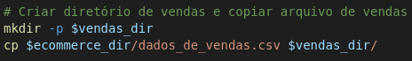
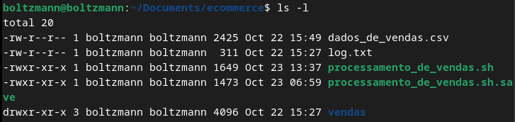
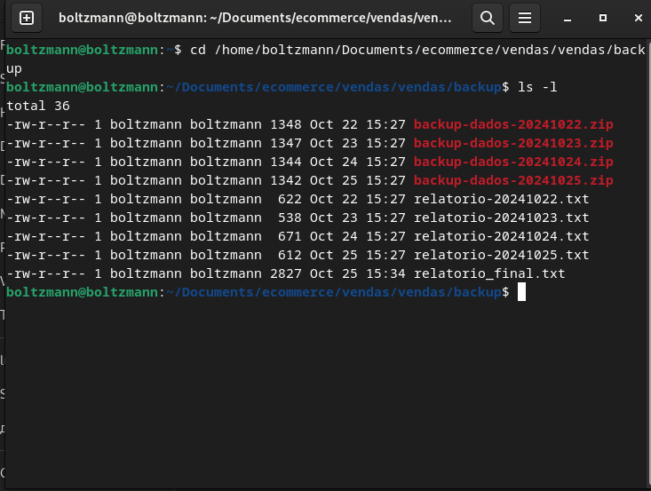
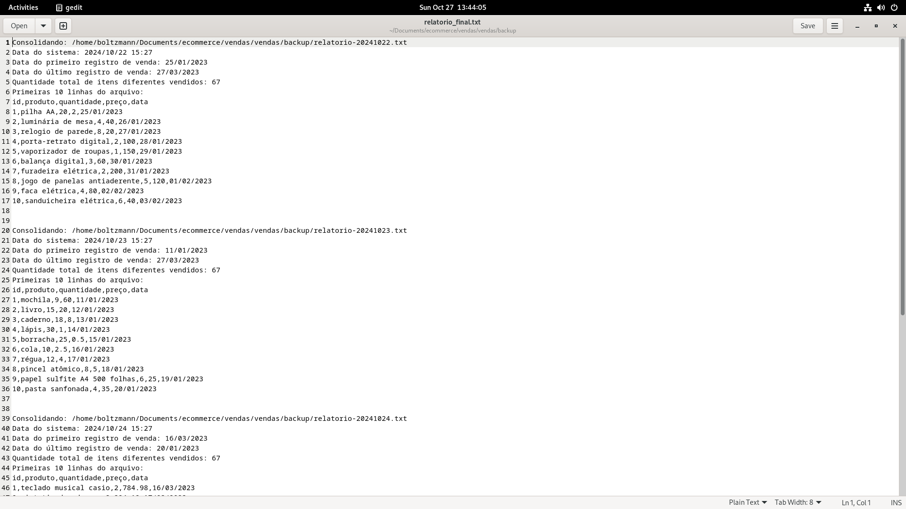

# Sprint 1 - Processamento de Vendas

## Instruções/Informações/Anotações

Nesta seção, apresentamos as instruções e informações relevantes sobre o processamento de vendas realizado durante a Sprint 1. Inclui a configuração do ambiente, criação de scripts e agendamento de tarefas.

- **Configuração do Ambiente**: Criamos um diretório para organizar os dados de vendas e os scripts de processamento.
- **Scripts Desenvolvidos**:
  - `processamento_de_vendas.sh`: Script responsável por processar os dados de vendas diariamente.
  - `consolidador_de_processamento_de_vendas.sh`: Script para consolidar os relatórios diários em um arquivo final.
- **Agendamento de Tarefas**: O script `processamento_de_vendas.sh` foi agendado para execução de terça a sexta-feira às 15:27 utilizando o cron.

## Exercícios

Durante a Sprint 1, realizamos os seguintes exercícios relacionados ao processamento de vendas:

- **Leitura de Dados**: Aprendemos a ler e manipular dados de um arquivo CSV, extraindo informações relevantes como a data do primeiro e do último registro de venda.
- **Geração de Relatórios**: Criamos relatórios diários com informações sobre o total de itens vendidos e os primeiros registros.
- **Consolidação de Relatórios**: Consolidamos os relatórios diários em um único arquivo `relatorio_final.txt`, unindo as informações coletadas ao longo da semana.

## Evidências

Foram coletadas evidências visuais da execução dos scripts e dos resultados obtidos:

- **Capturas de Tela**: Imagens que mostram a criação de diretórios e a execução dos scripts, além do conteúdo dos relatórios gerados. 
    - 
    - 
     - 
    - - 

  
## Certificados

Não houve certificados específicos para esta Sprint, mas o conhecimento adquirido foi aplicado em práticas de programação e automação de processos. 
