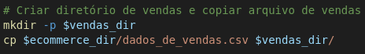
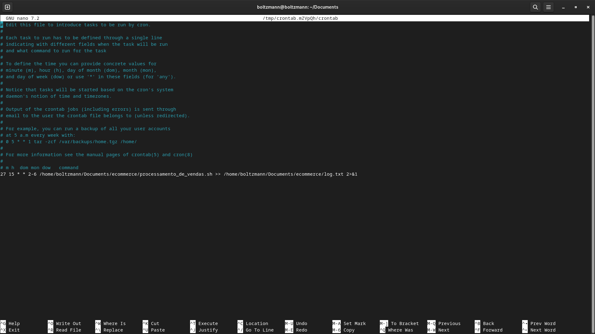
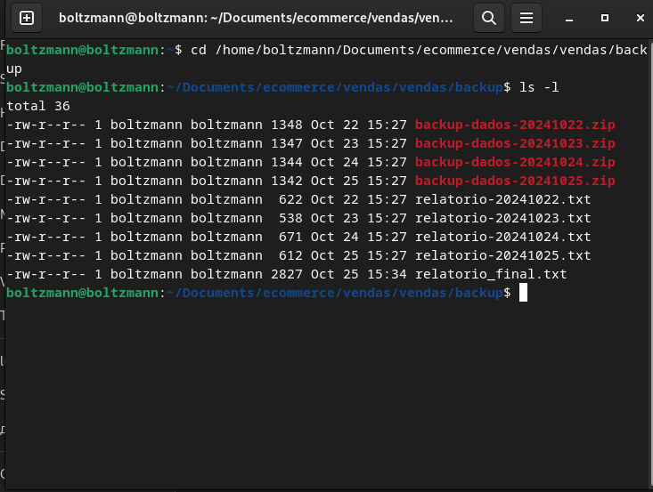

# Desafio: Processamento de Vendas

Neste projeto, desenvolvemos scripts para processar dados de vendas de uma loja online, gerando relatórios diários e consolidando-os em um relatório final. Abaixo estão os detalhes de cada etapa.

## Estrutura do Projeto

- **Diretório Principal**: `Desafio`
    - **Scripts**: Contém os scripts executáveis `.sh` necessários para o processamento de vendas e consolidação de relatórios.
    - **Evidências**: Imagens e capturas de tela dos resultados obtidos. Relatórios de vendas diários e o relatório final consolidado.

# Etapas

### Etapa I - Preparação do Ambiente

**Descrição**: Esta etapa envolveu a criação de um diretório inicial e cópia dos dados de vendas para esse diretório.


. **Cópia do Arquivo de Dados**:
   - O arquivo `dados_de_vendas.csv` foi copiado para o diretório `vendas` e para o `backup` com a data de execução.



### Etapa II - Criação do Script `processamento_de_vendas.sh`

O script `processamento_de_vendas.sh` automatiza o processo de backup, geração de relatórios diários e compressão de arquivos para economia de espaço.


A imagem abaixo mostra a pasta que foi criada a partir da diretório Ecommerce, temos a base de dados `dados_de_vendas` e `processamento_de_vendas` e a pasta `vendas` que foi gerada a partir da execucao do processamento de vendas.


No terminal mostrando a lista de arquivos


### Etapa III - Agendamento via cron

Para garantir a execução do script `processamento_de_vendas.sh` de terça a sexta-feira às 15:27, configuramos o cron:

1. Para abrir o crontab:
    ```bash
    crontab -e
    ```

2. Adicione a linha:
    ```bash
    27 15 * * 2-5 ~/Documents/ecommerce/processamento_de_vendas.sh
    ```

OBS: No projeto foi solicitado que fosse gerado de segunda a quinta às 15:27, mas no primeiro dia encontrei problemas para que fosse gerado o agendamento devido para colocar o caminho relativo completo do arquivo .sh. Entao coloquei que fosse gerado de terça a sexta-feira.

Abaixo a imagem de evidencia que colocamos dentro arquivo `crontab`.



Criei um log que pudesse me informar sobre se a criacao estava sendo realizada corretamente pelo `crontab`


### Etapa IV - Exemplos de Saída e Evidências

**Saída dos Relatórios Diários**

Exemplo de um relatório diário (22/10/2024):

```yaml
Data do sistema: 2024/10/22 15:27
Data do primeiro registro de venda: 01/01/2023
Data do último registro de venda: 31/03/2023
Quantidade total de itens vendidos: 200
Primeiras 10 linhas do arquivo:
id,produto,quantidade,preco,data
1,camiseta,2,29.90,01/01/2023
...
```

Foram inseridos os relatorios gerados de cada dia, estao presente na pasta Evidencias.

### Etapa V - Consolidação dos Relatórios Diários

Para unir todos os relatórios em um arquivo consolidado (`relatorio_final.txt`), criamos o script `consolidador_de_processamento_de_vendas.sh`:


### Observações sobre a Consolidação de Vendas

No quarto e último dia para a geração do script `consolidador_de_processamento_de_vendas.sh`, enfrentei um pequeno problema: percebi que foi gerada uma pasta adicional chamada `vendas`. Para evitar a perda de todo o trabalho de processamento de vendas realizado anteriormente, optei por ajustar o script `consolidador_de_processamento_de_vendas.sh`. 

Fiz as alterações necessárias para garantir que o arquivo `relatorio_final.txt` fosse gerado corretamente, preservando assim a integridade dos dados e o trabalho já realizado.


**Relatório Final Consolidado**

Todos os relatórios diários foram reunidos no `relatorio_final.txt`.



### Conclusão

Neste desafio, implementamos um sistema automatizado para o processamento e consolidação de dados de vendas. As etapas incluíram a criação de um ambiente organizado, a configuração de agendamentos via cron para a execução automática de scripts, e a consolidação dos relatórios diários em um arquivo final.
