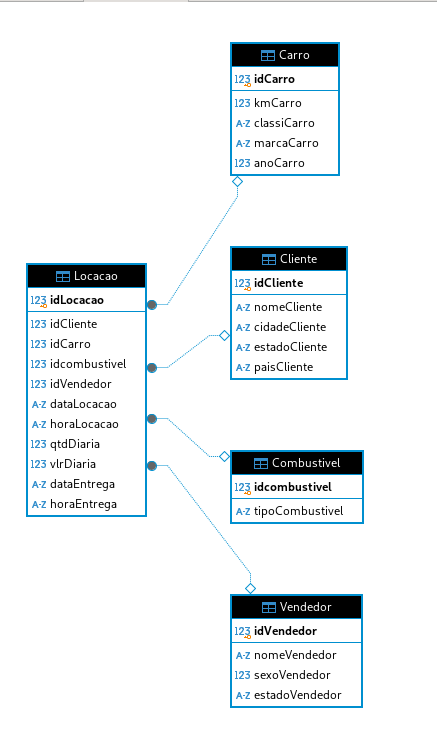

# Sprint 1 - Normalização e Modelo Dimensional de Banco de Dados

## Instruções/Informações/Anotações

Nesta seção, apresentamos as instruções e informações relevantes sobre o processo de normalização e criação do modelo dimensional para o banco de dados da concessionária, realizado durante a Sprint 1. Esta atividade envolveu análise da estrutura de dados, criação de tabelas normalizadas, implementação de views para o modelo dimensional e aplicação de boas práticas em SQL.

- **Configuração do Ambiente**: Utilizamos o DBeaver para conectar e manipular a base de dados `concessionaria.sqlite`. Estruturamos as tabelas e views, organizando o modelo de dados de forma eficiente e consistente.
- **Scripts Desenvolvidos**:
  - Tabelas Normalizadas: Scripts para criar as tabelas `Cliente`, `Carro`, `Combustivel`, `Vendedor` e `Locacao`, cada uma com sua chave primária e relações estabelecidas.
  - Views para o Modelo Dimensional: Criamos as views `Fato_Locacao`, `Dim_Cliente`, `Dim_Carro`, `Dim_Combustivel` e `Dim_Vendedor` para estruturar o modelo dimensional de forma lógica.
- **Desafios Encontrados**:
  - **Duplicidade de Dados**: Identificamos e tratamos registros duplicados ao normalizar os dados de `tb_locacao`, principalmente na tabela `Carro`, utilizando subconsultas para selecionar registros únicos.
  - **Visualização de Relacionamentos no ER Diagram**: Como as views não suportam diretamente chaves estrangeiras, criamos tabelas temporárias para simular os relacionamentos e facilitar a visualização.

## Exercícios

Durante a Sprint 1, realizamos os seguintes exercícios e atividades relacionadas ao processamento e estruturação do banco de dados:

- **Análise e Normalização de Dados**: Dividimos a tabela `tb_locacao` em entidades normalizadas, aplicando as formas normais para eliminar redundâncias e garantir a integridade referencial.
- **Modelo Dimensional**: Construímos um modelo dimensional com base no modelo relacional, usando views para representar a tabela de fatos e as dimensões de cliente, carro, combustível e vendedor.
- **Desenho dos Modelos**: Elaboramos diagramas para representar o modelo relacional e o modelo dimensional, documentando as relações e estruturas resultantes.

## Evidências

Foram coletadas evidências das tabelas e views criadas, além de capturas de tela do ambiente de desenvolvimento:

- **Capturas de Tela**: Imagens que mostram a criação de tabelas e views, assim como o diagrama ER.
    - 
    - 
    - 
    - 

## Certificados

Durante esta Sprint, concluímos o curso **AWS Partner: Sales Accreditation (Business) (Portuguese)** em 11/8/2024, focado em fundamentos de soluções da AWS para negócios e processos de vendas. Este curso aprofundou o conhecimento em práticas e ferramentas da AWS, além de fornecer um certificado de conclusão que comprova o aprendizado adquirido.

## Conclusão

A Sprint 1 foi uma etapa crucial para o desenvolvimento de habilidades em modelagem de dados e SQL. A aplicação das formas normais e a criação do modelo dimensional proporcionaram uma compreensão mais profunda de estruturação de bancos de dados. As práticas aplicadas durante o desafio refletem o desenvolvimento técnico e organizacional necessário para otimizar bancos de dados e facilitar a análise e manutenção dos dados.
