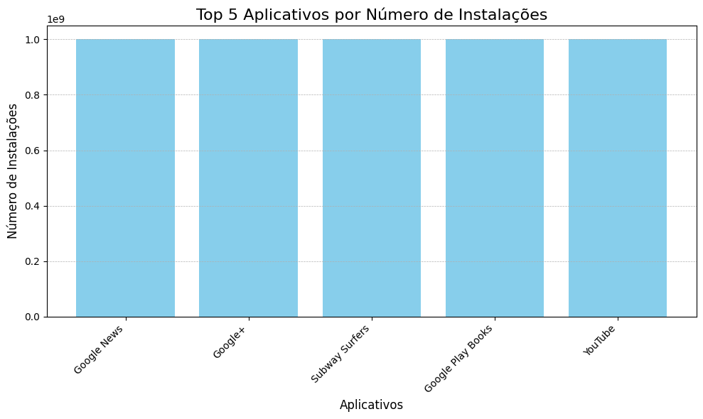
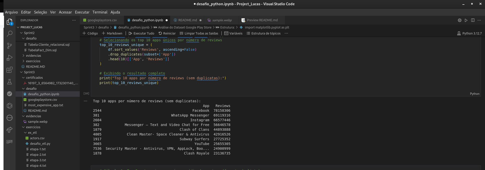

# Sprint 3 - Análise de Dados e ETL com Python

## Instruções/Informações/Anotações

[**Acesse aqui a pasta `exercicios` contendo os códigos dos exercícios realizados na Sprint 3.**](../Sprint3/exercicios/)

Nesta sprint, o foco principal foi o desenvolvimento de habilidades em análise de dados utilizando Python, com ênfase em manipulação, limpeza, visualização e extração de insights a partir de datasets. Além disso, realizamos um **desafio de ETL** com a tabela `actors.csv`, consolidando os conhecimentos adquiridos.

- **Configuração do Ambiente**: Utilizamos Python como principal ferramenta, junto com bibliotecas como **pandas**, **matplotlib** e **numpy** para análise de dados. Os scripts foram desenvolvidos em um ambiente configurado com Jupyter Notebook e também executados diretamente via linha de comando.
- **Atividades Realizadas**:
  - **Exercícios de Análise de Dados**: Resolvi 25 exercícios que cobriram tópicos como limpeza de dados, agrupamento, agregação, tratamento de valores ausentes e geração de gráficos.
  - **Desafio de ETL**: Processamos a tabela `actors.csv` utilizando Python puro (sem bibliotecas como pandas), aplicando técnicas de ETL para gerar insights em etapas consecutivas.
  - **Estudo de Economia na Nuvem AWS**: Concluí o curso **AWS Partner: Economias na Nuvem AWS**, adquirindo conhecimentos sobre práticas de economia e otimização de custos na utilização de serviços AWS.
- **Desafios Encontrados**:
  - **Tratamento Manual de Dados no Desafio ETL**: Como o uso de bibliotecas como pandas estava proibido no desafio, todas as operações foram realizadas manualmente com loops e manipulação de strings, exigindo atenção para tratar formatos inconsistentes.
  - **Geração de Visualizações Personalizadas**: Ao criar gráficos detalhados com matplotlib, foi necessário ajustar estilos, rótulos e configurações para melhor apresentação dos dados.

---

## Exercícios

Durante a Sprint 3, foram realizados 25 exercícios que cobriram tópicos fundamentais de análise de dados com Python:

1. **Limpeza e Transformação de Dados**:
   - Tratamento de valores ausentes.
   - Conversão de colunas categóricas para numéricas.
   - Remoção de caracteres especiais em colunas como `Installs` e `Price`.

2. **Agrupamento e Estatísticas**:
   - Geração de métricas como média, mediana e soma em agrupamentos por categorias.
   - Análise de correlações entre variáveis numéricas.

3. **Visualização de Dados**:
   - Criação de gráficos de barras, dispersão e pizza utilizando matplotlib.
   - Exploração dos insights por meio de representações visuais claras.

---

## Desafio ETL com a Tabela `actors.csv`

O desafio de ETL consistiu em processar a tabela `actors.csv` sem o uso de bibliotecas como pandas ou csv. O processo foi dividido em cinco etapas principais:

1. **Etapa 1**: Identificação do ator/atriz com o maior número de filmes e geração de um relatório com o nome e quantidade.
2. **Etapa 2**: Cálculo da média de receita bruta dos filmes de maior bilheteria.
3. **Etapa 3**: Determinação do ator/atriz com a maior média de receita por filme.
4. **Etapa 4**: Contagem de frequência dos filmes de maior bilheteria no dataset.
5. **Etapa 5**: Ordenação dos atores por receita total de bilheteria e geração de um relatório final.

Os resultados foram salvos em arquivos `.txt` e analisados para validar os dados processados.

---

## Evidências

Foram coletadas evidências do processo de análise e do desafio ETL, incluindo capturas de tela, códigos desenvolvidos e saídas geradas:

- **Capturas de Tela**:
  - 
  - 
  - 

- **Saídas do Desafio ETL**: [Clique aqui para ir a pasta de exercicios de ETL](../Sprint3/exercicios/ex_etl/)
  - Arquivo `etapa-1.txt`: Contém o nome do ator com mais filmes.
  - Arquivo `etapa-2.txt`: Contém a média de receita dos filmes.
  - Arquivo `etapa-5.txt`: Relatório final ordenado por receita bruta.

---

## Certificados

Durante esta sprint, concluímos o curso **AWS Partner: Economias na Nuvem AWS**, no qual foram abordados tópicos como:
- Otimização de custos em soluções AWS.
- Práticas recomendadas para gerenciar gastos com recursos em nuvem.
- Estratégias para maximizar o uso de serviços sem comprometer a eficiência.

O curso foi concluído com sucesso, e o certificado de conclusão foi adicionado como evidência.

---

## Conclusão

A Sprint 3 foi altamente produtiva e desafiadora, proporcionando:
1. Aprendizado prático em manipulação e análise de dados com Python.
2. Desenvolvimento de habilidades em ETL manual, reforçando conceitos fundamentais.
3. Consolidação de conhecimentos em economia de recursos na nuvem AWS.

O aprendizado obtido contribuiu significativamente para aprimorar técnicas de análise e visualização de dados, preparando para desafios mais avançados em projetos futuros.

---
