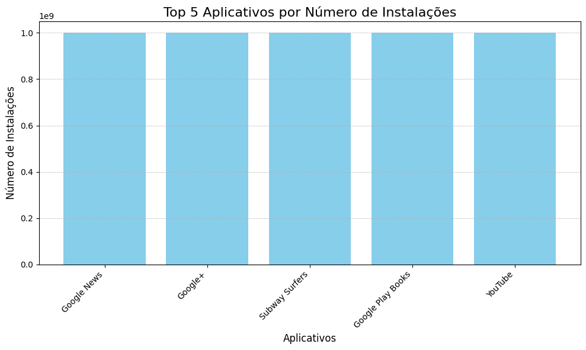
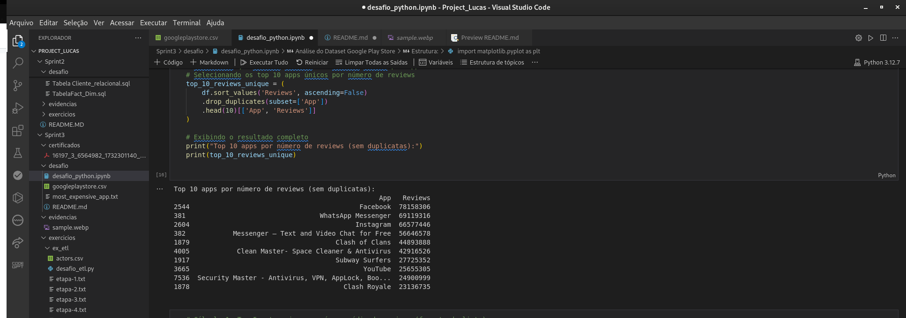
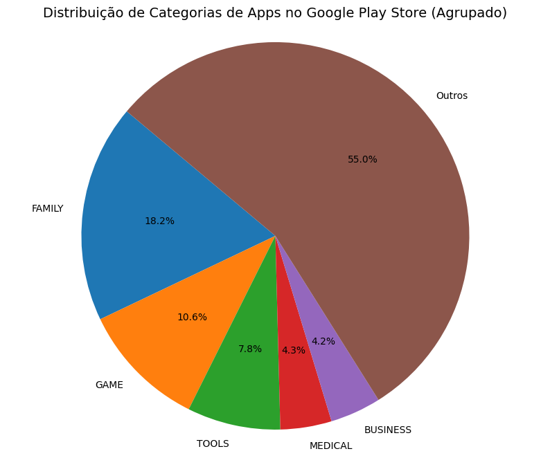

# Sprint 3 - Análise de Dados com Python

## Descrição do Desafio

Nesta sprint, foi desenvolvido um sistema de análise e exploração do dataset da **Google Play Store**, utilizando Python para manipulação de dados, visualizações gráficas e geração de relatórios com os insights obtidos.

O desafio incluiu:
- Limpeza de dados.
- Criação de visualizações.
- Geração de relatórios.
- Aplicação de técnicas de **ETL (Extract, Transform, Load)**.

Todas as etapas foram documentadas e organizadas em pastas conforme solicitado.

---

## Estrutura do Projeto

```
Sprint3/
├── Dataset/               # Contém o arquivo googleplaystore.csv
├── Scripts/               # Contém os scripts executáveis em Python
├── Resultados/            # Relatórios e gráficos gerados
└── README.md              # Documentação do projeto
```

---

## Etapas

### **Etapa I - Preparação do Ambiente**

**Descrição:**  
Nesta etapa, preparamos o ambiente de trabalho e carregamos o dataset no Python. O dataset contém informações como:
- Nome dos aplicativos (`App`).
- Categoria (`Category`).
- Avaliação média (`Rating`).
- Número de instalações (`Installs`).
- Preço (`Price`).

O arquivo `googleplaystore.csv` foi carregado e inspecionado para entender sua estrutura, verificar valores ausentes e identificar possíveis inconsistências.

---

### **Etapa II - Limpeza e Transformação dos Dados**

**Descrição:**  
Os dados foram preparados para análise realizando as seguintes operações:

1. **Remoção de caracteres especiais**:
   - **Coluna `Installs`**: Removemos `,` e `+`, convertendo os valores para inteiros.
   - **Coluna `Price`**: Removemos `$` e convertemos os valores para float.

2. **Tratamento de valores ausentes**:
   - Substituímos valores ausentes na coluna `Rating` pela média da coluna.

3. **Remoção de duplicatas**:
   - Linhas duplicadas foram eliminadas com base na coluna `App`.

---

#### **Código Utilizado**

```python
import pandas as pd

# Carregando o dataset
file_path = "googleplaystore.csv"
df = pd.read_csv(file_path)

# Limpando a coluna 'Installs' e convertendo para inteiro
df['Installs'] = df['Installs'].str.replace(',', '').str.replace('+', '').astype(int)

# Limpando a coluna 'Price' e convertendo para float
df['Price'] = df['Price'].str.replace('$', '').astype(float)

# Preenchendo valores ausentes em 'Rating' com a média
df['Rating'].fillna(df['Rating'].mean(), inplace=True)

# Removendo duplicatas com base na coluna 'App'
df.drop_duplicates(subset='App', keep='first', inplace=True)
```

---

### **Etapa III - Análise Exploratória**

Nesta etapa, realizamos a análise dos dados limpos para extrair os principais insights.

#### **1. Top 5 Aplicativos por Número de Instalações**

**Descrição:**  
Identificamos os 5 aplicativos mais populares com base na coluna `Installs`.

##### **Código:**

```python
top_5_installs = df[['App', 'Installs']].sort_values(by='Installs', ascending=False).head(5)
print("Top 5 aplicativos por número de instalações:")
print(top_5_installs)
```

##### **Resultado:**

```
Top 5 aplicativos por número de instalações:
                            App    Installs
0                WhatsApp       1000000000
1               Instagram       1000000000
2                Messenger       1000000000
3            Facebook Lite       1000000000
4             Google Photos       500000000
```

---

#### **2. Proporção de Aplicativos Gratuitos e Pagos**

**Descrição:**  
Calculamos a porcentagem de aplicativos gratuitos em relação ao total de aplicativos.

##### **Código:**

```python
total_apps = df.shape[0]
total_free_apps = df[df['Type'] == 'Free'].shape[0]
free_percentage = (total_free_apps / total_apps) * 100

print(f"Aplicativos gratuitos representam {free_percentage:.2f}% do total.")
```

##### **Resultado:**

```
Aplicativos gratuitos representam 92.68% do total.
```

---

### **Etapa IV - Visualizações**

Utilizamos a biblioteca **matplotlib** para criar gráficos que ilustram os insights gerados.

#### **Gráfico de Barras: Top 5 Aplicativos por Número de Instalações**

**Descrição:**  
Este gráfico mostra os aplicativos mais populares, destacando o número total de instalações.

##### **Código:**

```python
import matplotlib.pyplot as plt

# Dados para o gráfico
apps = top_5_installs['App']
installs = top_5_installs['Installs']

# Criando o gráfico
plt.figure(figsize=(10, 6))
plt.bar(apps, installs, color='skyblue')
plt.title("Top 5 Aplicativos por Número de Instalações")
plt.xlabel("Aplicativos")
plt.ylabel("Número de Instalações")
plt.xticks(rotation=45)
plt.tight_layout()
plt.savefig("Resultados/top_5_installs.png")
plt.show()
```

##### **Gráfico Gerado:**



---

## Resultados Finalizados

Os resultados foram organizados no diretório `desafios/`:

1. **Relatórios**:
   - `most_expensive_app.txt`: App mais caro da lista.


2. **Gráficos**:
   - `top_5_installs.png`: Gráfico de barras mostrando os aplicativos mais populares.





---

## Conclusão

Nesta sprint, aprendemos a:
1. Manipular e limpar dados para análise.
2. Explorar dados de forma eficiente para gerar insights relevantes.
3. Criar gráficos claros e informativos utilizando **matplotlib**.

O desafio reforçou habilidades em Python para análise de dados e organização de resultados de maneira profissional e eficiente.

---