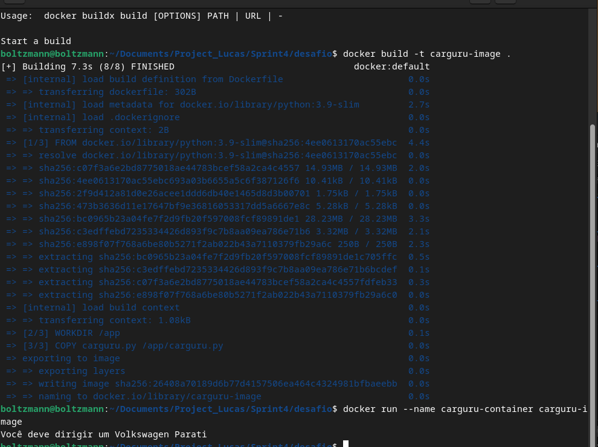
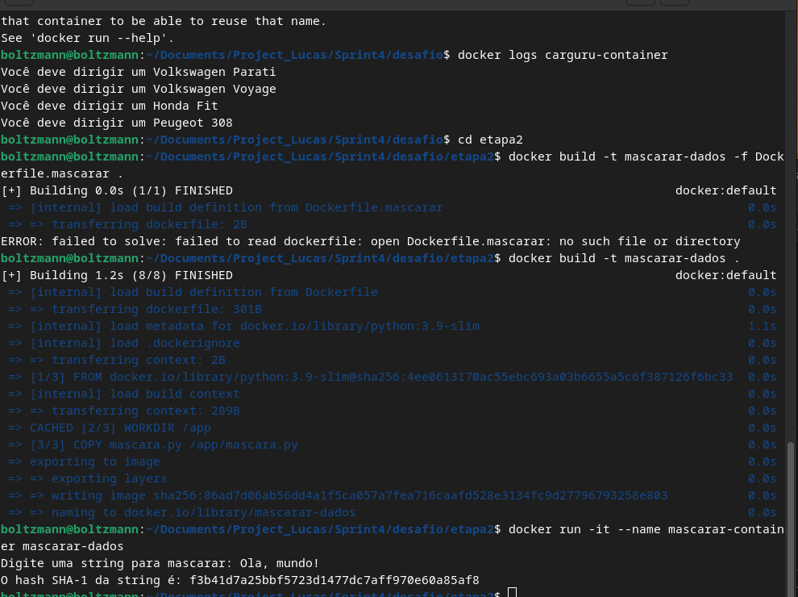
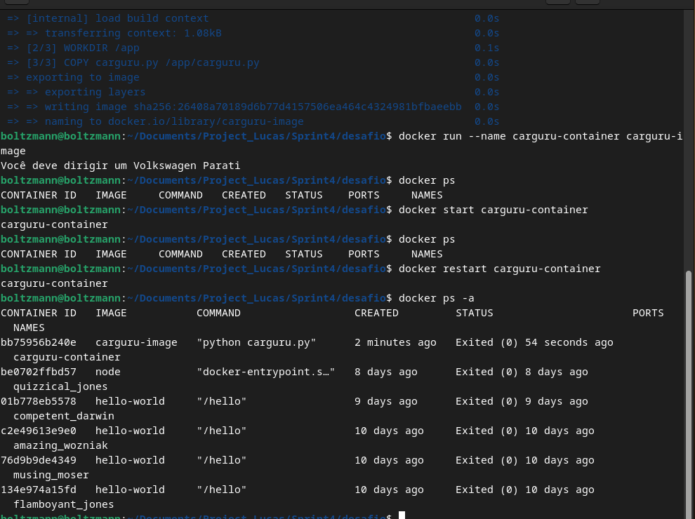

# **Resumo da Sprint**

https://www.credly.com/badges/17931c6c-a94e-4c79-813b-081729e7839a/public_url

## **Instruções/Informações/Anotações**

Durante esta sprint, exploramos o uso de containers Docker combinados com scripts Python para criar aplicações modulares, reutilizáveis e portáteis. O foco principal foi na prática de construção, execução e gerenciamento de imagens e containers. Também foram apresentadas informações sobre boas práticas no desenvolvimento com Docker, comandos essenciais e como configurar imagens utilizando arquivos `Dockerfile`.

---

## Exercícios

### Exercício 1: Manipulação de Números em Arquivo

Neste exercício, foi necessário abrir um arquivo de texto, filtrar e ordenar números pares, e calcular a soma dos 5 maiores. A solução foi implementada com o uso das funções `filter` e `sorted`.

[Veja o código completo para o exercício 1 aqui](../Sprint4/exercicios/ex01.py).
### Exercício 2: Contagem de Vogais em uma String

Aqui, o objetivo foi contar o número de vogais em uma string utilizando a função `filter` com uma expressão `lambda` para identificar as vogais.

[Veja o código completo para o exercício 2 aqui](../Sprint4/exercicios/ex02.py).

### Exercício 3: Cálculo de Saldo com Lançamentos

Foi necessário calcular o saldo a partir de lançamentos, onde cada lançamento é representado por um valor e um tipo ('C' para crédito, 'D' para débito). Utilizamos `map` para transformar os valores e `reduce` para calcular o saldo.

[Veja o código completo para o exercício 3 aqui](../Sprint4/exercicios/ex03.py).

### Exercício 4: Cálculo do Valor Máximo de Operações

O exercício envolveu a criação de uma função que realiza operações aritméticas e retorna o valor máximo. Utilizamos a função `eval` para executar dinamicamente as operações.

[Veja o código completo para o exercício 4 aqui](../Sprint4/exercicios/ex04.py).

### Exercício 5: Processamento de Notas com CSV

Foi necessário ler um arquivo CSV, processar as notas dos estudantes e calcular a média das 3 maiores. Para isso, utilizamos o módulo `csv` para fazer a leitura e a manipulação dos dados.

[Veja o código completo para o exercício 5 aqui](../Sprint4/exercicios/ex05.py).

### Exercício 6: Produtos Acima da Média

Neste exercício, foi necessário filtrar produtos cujo preço seja maior que a média, ordenando-os em ordem crescente. Utilizamos o `lambda` para fazer as comparações e `sorted` para ordenar.

[Veja o código completo para o exercício 6 aqui](../Sprint4/exercicios/ex06.py).

### Exercício 7: Gerador de Números Pares

O exercício consistiu na criação de um gerador que retorna números pares até um valor `n`. Utilizamos a estrutura `yield` para gerar os números de forma eficiente.

[Veja o código completo para o exercício 7 aqui](../Sprint4/exercicios/ex07.py).

---

### Desafio - Reutilização de Containers
Objetivo:

Demonstrar como reutilizar containers parados, facilitando o gerenciamento de containers e economizando tempo ao evitar a necessidade de recriação.
Atividades:

Reiniciar containers com docker start -ai:
O comando docker start -ai <container_name> foi utilizado para reiniciar containers parados, permitindo a interação com o processo em execução.
        Exemplo:

    docker start -ai mascarar-container

Recriar containers com docker run:

Quando necessário, recriamos containers usando docker run -it --name <container_name> <image_name>.
    Exemplo:

    docker run -it --name mascarar-container mascarar-dados

Gerenciamento de estado:

O comando docker ps -a foi utilizado para listar todos os containers, tanto em execução quanto parados.
    Exemplo:

        docker ps -a

Discussão:

A reutilização de containers ajuda a economizar tempo e recursos, permitindo testar novamente sem recriar o ambiente. Para evitar perdas de dados, é importante usar volumes do Docker quando necessário.

---

## **Evidências**

- **Execução do container `carguru-container`:**

- **Execução do container `mascarar-container`:**

- **Comando `docker ps` para listar containers ativos:**
 

---

## **Certificados**

Durante esta sprint, concluímos o curso AWS Partner: Credenciamento (Técnico), no qual foram abordados tópicos como:

    -Fundamentos técnicos da AWS: Compreensão dos serviços e recursos fundamentais da plataforma AWS.
    -Melhores práticas de implementação: Orientações para a implementação eficiente de soluções na nuvem.
    -Gerenciamento de infraestrutura na AWS: Como configurar e gerenciar ambientes seguros e escaláveis na nuvem.

O curso foi concluído com sucesso, e o certificado de conclusão foi adicionado como evidência.

---

## **Conclusão**

Esta sprint proporcionou uma base sólida para o uso de Docker no desenvolvimento de aplicações em Python. O aprendizado envolveu desde a construção de imagens até a execução de containers interativos, além de boas práticas para reutilização e gerenciamento. A experiência adquirida é essencial para projetos futuros que demandem soluções portáveis e escaláveis.
