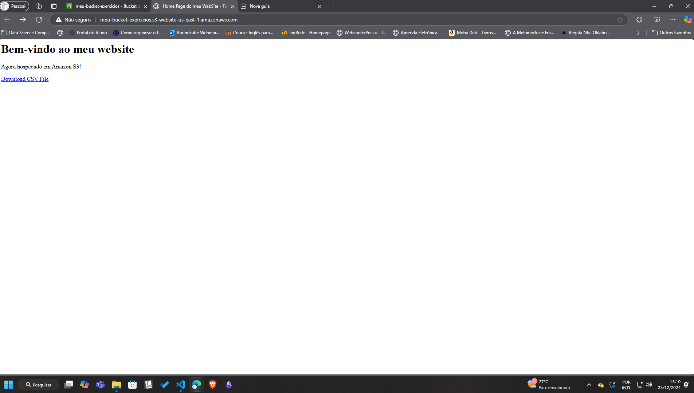
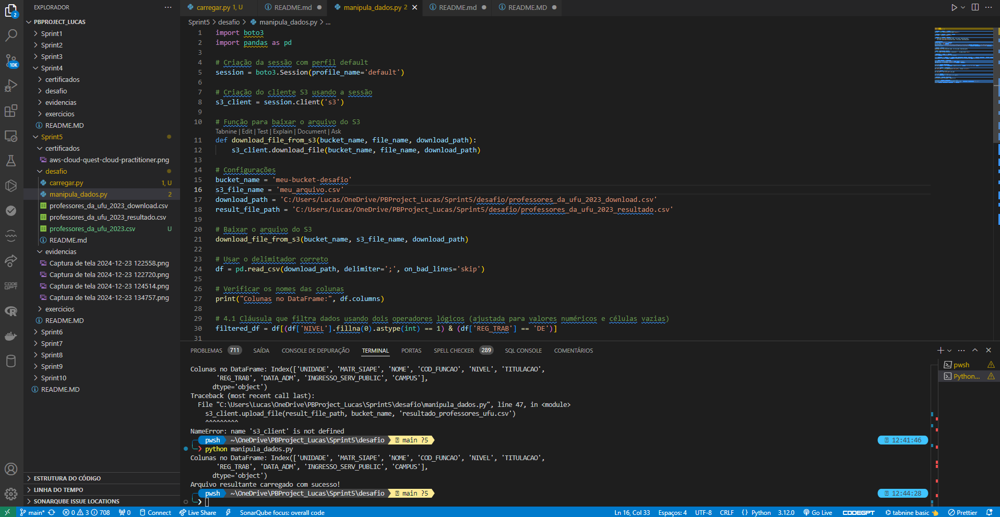

# **Resumo da Sprint**

## **Instruções/Informações/Anotações**

Durante esta sprint, o objetivo foi carregar um arquivo CSV para um bucket no AWS S3, realizar manipulações específicas de dados usando a biblioteca Pandas, e depois salvar e fazer upload do arquivo manipulado de volta para o S3. Essa atividade prática envolveu a configuração de ambientes, manipulação de dados e integração com serviços AWS.

---

## **Exercícios**

### **Exercício: Configuração de Bucket e Hospedagem de Site Estático no AWS S3**

Neste exercício, configurei um bucket no AWS S3 para hospedar um site estático. Criei o bucket, habilitei a hospedagem de site, configurei as permissões de acesso público, e fiz o upload dos arquivos necessários (`index.html`, `404.html` e o arquivo CSV). O endpoint do site foi testado e verificado com sucesso.

## **Evidências**

- **Criação do Bucket e Configuração de Hospedagem:**

- **Configuração de Permissões de Acesso Público:**

- **Upload dos Arquivos:**

- **Teste do Endpoint no Navegador:**

---

## **Conclusão**

Essa atividade foi essencial para explorar as capacidades do AWS S3 na hospedagem de conteúdo estático. O processo de criação, configuração e teste do bucket foi concluído com sucesso, evidenciando a eficácia do S3 para este propósito.

---

### **Desafio - Manipulação de Dados e Upload para o S3**

#### **Objetivo:**

Realizar manipulações de dados em um arquivo CSV utilizando Pandas, e gerenciar o upload e download do arquivo no AWS S3.

#### **Atividades:**

1. **Configuração e Autenticação:**
   - Configurar o AWS CLI com as credenciais corretas para permitir a interação com o S3.
   - Verificar e ajustar as credenciais no arquivo `~/.aws/credentials`.

2. **Upload Inicial do Arquivo CSV para o S3:**
   - Carregar o arquivo `professores_da_ufu_2023.csv` para o bucket S3 utilizando `boto3`.

3. **Manipulação dos Dados:**
   - Baixar o arquivo do S3 para um diretório local.
   - Carregar o arquivo em um DataFrame `Pandas`.
   - Realizar as manipulações necessárias:
     - Filtrar dados.
     - Realizar agregações.
     - Aplicar transformações de colunas.
   - Salvar o resultado em um novo arquivo CSV.

4. **Upload do Arquivo Manipulado:**
   - Fazer o upload do arquivo manipulado de volta para o bucket S3.

---

## **Evidências**

- **Execução do Script e Manipulação de Dados:**

- **Upload do Arquivo para S3:**

---

## **Certificado**

[Certificado de Conclusão do Cloud Quest](https://www.credly.com/badges/17931c6c-a94e-4c79-813b-081729e7839a/public_url)

-- 

## **Conclusão**

Essa sprint proporcionou uma experiência prática valiosa na integração de serviços AWS com Python e na manipulação de dados usando Pandas. Enfrentei e resolvi problemas de configuração de credenciais e tokenização de dados, fortalecendo minhas habilidades em gerenciamento de dados e segurança na nuvem. A prática adquirida será fundamental para futuros projetos que envolvam processamento e armazenamento de dados na AWS.

---
