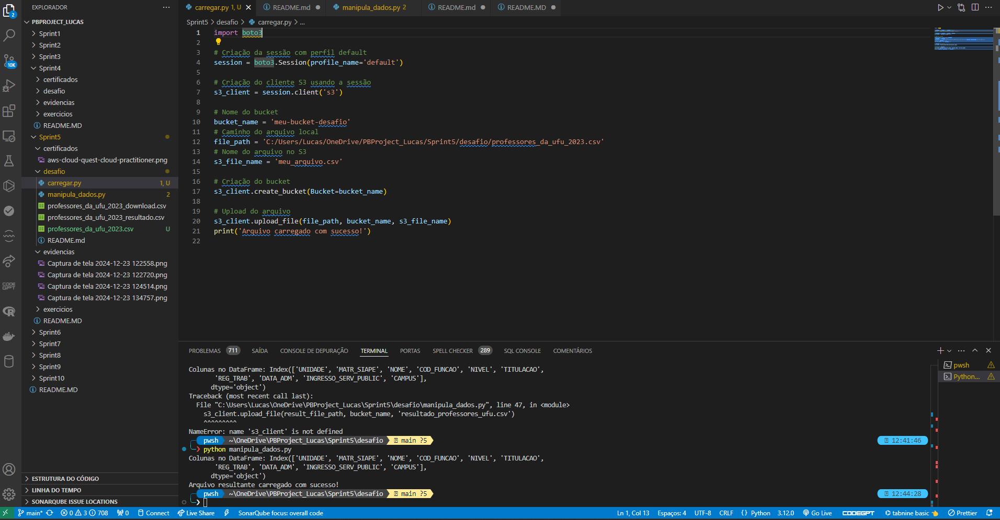
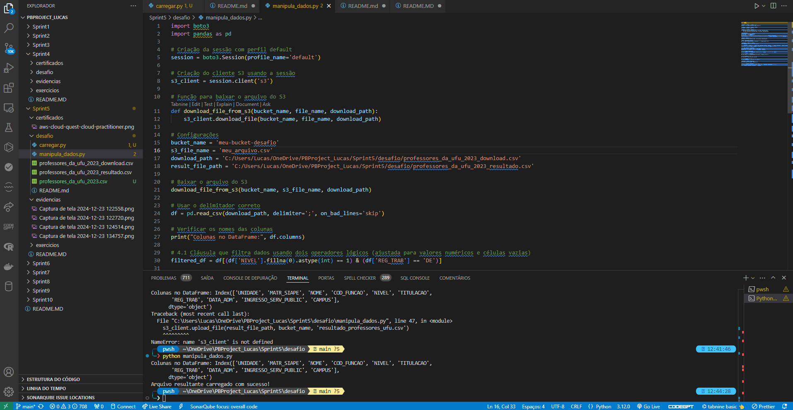
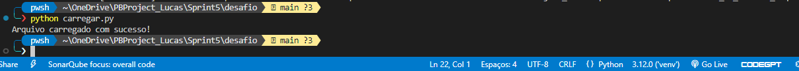
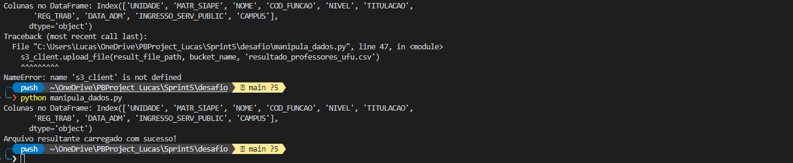
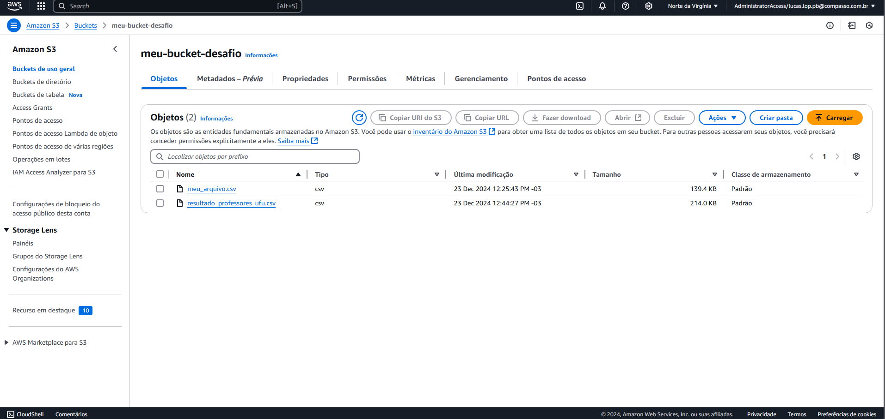

#  Instruções/Informações/Anotações 

Durante esta sprint, o objetivo foi carregar um arquivo CSV para um bucket no AWS S3, realizar manipulações específicas de dados usando a biblioteca Pandas, e depois salvar e fazer upload do arquivo manipulado de volta para o S3. Essa atividade prática envolveu a configuração de ambientes, manipulação de dados e integração com serviços AWS.

## **Exercícios**

### **Exercício 1: Configuração Inicial**

Instalação das Bibliotecas: Instalei as bibliotecas necessárias (boto3 e pandas) utilizando pip.

Configuração do Ambiente Virtual: Configurei um ambiente virtual para isolar as dependências do projeto.

Credenciais AWS: Configurei as credenciais da AWS usando o AWS CLI para garantir a comunicação segura com o S3.

### **Exercício 2: Carregamento do Arquivo CSV para o S3**

Criação do Cliente S3: Utilizei o boto3 para criar um cliente S3.

Upload do Arquivo: Carreguei o arquivo professores_da_ufu_2023.csv para o bucket meu-bucket-desafio.

### **Exercício 3: Manipulação dos Dados com Pandas**

Baixar o Arquivo do S3: Baixei o arquivo carregado do S3 para manipulação.

Carregar o Arquivo em um DataFrame: Usei pandas para carregar o arquivo CSV em um DataFrame.

Filtragem de Dados: Filtrei os dados para manter apenas registros onde NIVEL é 1 e REG_TRAB é DE.

Agregações: Realizei duas agregações: contagem de MATR_SIAPE e contagem distinta de COD_FUNCAO por CAMPUS.

Manipulações Condicionais e de Conversão: Adicionei uma coluna baseada em uma condição (TITULACAO), converti datas, extraí ano de admissão, e converti nomes para maiúsculas.

Salvar o Resultado: Salvei o DataFrame manipulado em um novo arquivo CSV.

### **Exercício 4: Upload do Arquivo Manipulado para o S3**

Upload do Arquivo Resultante: Fiz o upload do arquivo resultante resultado_professores_ufu.csv de volta para o bucket S3.

Desafio - Manipulação de Dados e Upload para o S3
Objetivo:
Realizar manipulações de dados em um arquivo CSV utilizando Pandas, e gerenciar o upload e download do arquivo no AWS S3.


## **Atividades:**

Configuração e Autenticação:

Configurar o AWS CLI com as credenciais corretas para permitir a interação com o S3.

Verificar e ajustar as credenciais no arquivo ~/.aws/credentials.

Upload Inicial do Arquivo CSV para o S3:

Carregar o arquivo professores_da_ufu_2023.csv para o bucket S3 utilizando boto3.

Manipulação dos Dados:

Baixar o arquivo do S3 para um diretório local.

Carregar o arquivo em um DataFrame Pandas.

Realizar as manipulações necessárias:

Filtrar dados.

Realizar agregações.

Aplicar transformações de colunas.

Salvar o resultado em um novo arquivo CSV.

Upload do Arquivo Manipulado:

Fazer o upload do arquivo manipulado de volta para o bucket S3.

## **Evidências**

Execução do Script e Manipulação de Dados:

O arquivo para carregar o arquivo `carregar.py`

```import boto3

# Criação da sessão com perfil default
session = boto3.Session(profile_name='default')

# Criação do cliente S3 usando a sessão
s3_client = session.client('s3')

# Nome do bucket
bucket_name = 'meu-bucket-desafio'
# Caminho do arquivo local
file_path = 'C:/Users/Lucas/OneDrive/PBProject_Lucas/Sprint5/desafio/professores_da_ufu_2023.csv'
# Nome do arquivo no S3
s3_file_name = 'meu_arquivo.csv'

# Criação do bucket
s3_client.create_bucket(Bucket=bucket_name)

# Upload do arquivo
s3_client.upload_file(file_path, bucket_name, s3_file_name)
print('Arquivo carregado com sucesso!')
```





Retorno de sucesso dos codigos para execucacao:




Upload do Arquivo para S3:




## **Conclusão**
Essa sprint proporcionou uma experiência prática valiosa na integração de serviços AWS com Python e na manipulação de dados usando Pandas. Enfrentei e resolvi problemas de configuração de credenciais e tokenização de dados, fortalecendo minhas habilidades em gerenciamento de dados e segurança na nuvem. A prática adquirida será fundamental para futuros projetos que envolvam processamento e armazenamento de dados na AWS.