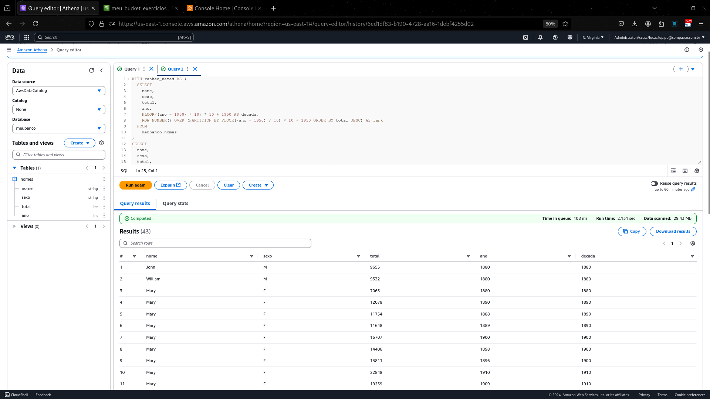
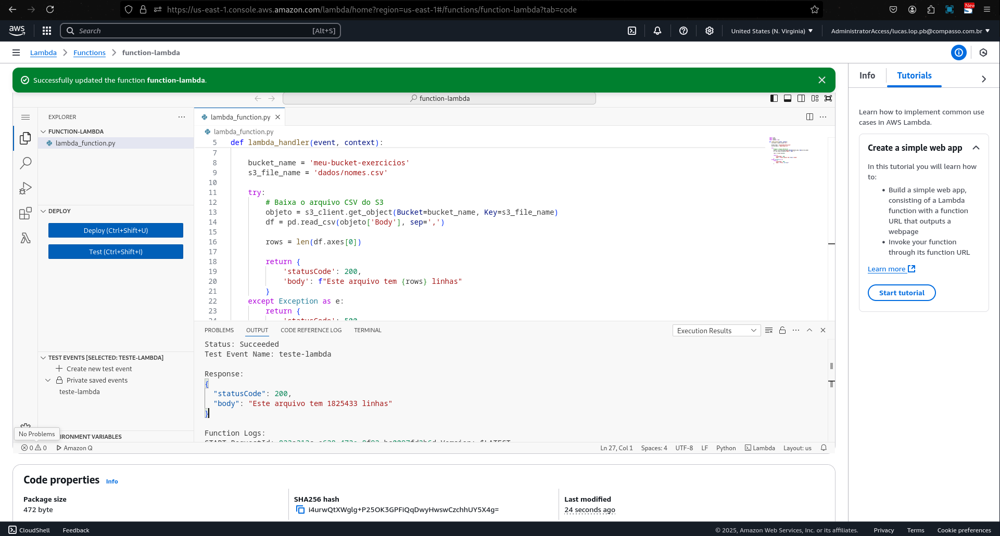
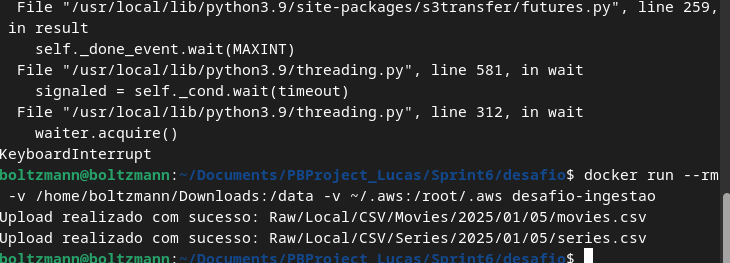
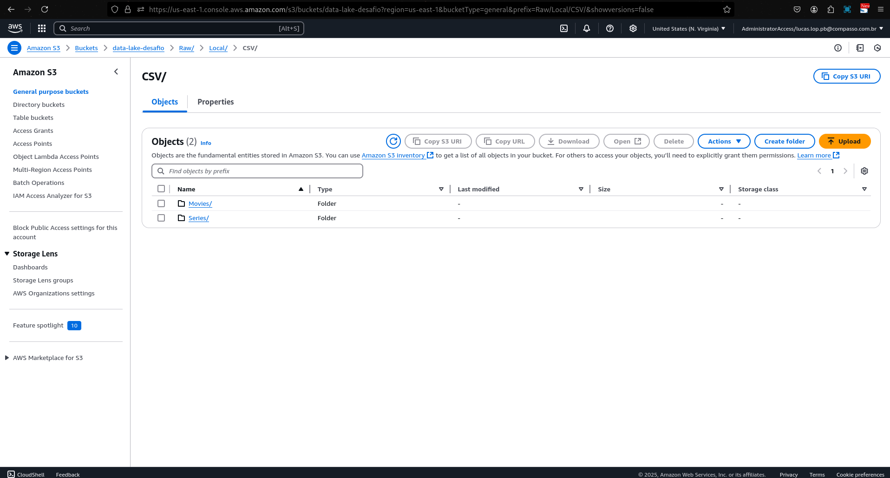

# Resumo da Sprint 6

## Instruções/Informações/Anotações

Nesta sprint, o foco principal foi explorar os serviços AWS Athena e AWS Lambda para consulta e manipulação de dados, além de fortalecer as habilidades com integração de serviços na nuvem. Também foi realizado um desafio prático utilizando AWS S3 e Docker para ingestão de dados e preparação para análise.

## Exercícios

Exercício 1: Configuração e Consultas no AWS Athena

Neste exercício, foi configurado o AWS Athena para executar consultas em um arquivo CSV hospedado no AWS S3. As etapas principais incluíram:

    Configuração do local de saída para consultas no S3.
    Criação de um banco de dados chamado meubanco.
    Criação de uma tabela no banco de dados para leitura dos dados do CSV.
    Execução de consultas para extrair informações específicas do dataset.

Evidências



O codigo usado foi esse:
```
CREATE DATABASE meubanco;

Criação da Tabela:

CREATE EXTERNAL TABLE IF NOT EXISTS meubanco.nomes (
    nome STRING,
    idade INT,
    cidade STRING
)
ROW FORMAT SERDE 'org.apache.hadoop.hive.serde2.lazy.LazySimpleSerDe'
WITH SERDEPROPERTIES (
    'serialization.format' = ',',
    'field.delim' = ','
)
LOCATION 's3://bucket-exemplo/dados/';
```
Consulta no Athena:

    SELECT cidade, COUNT(*) AS total
    FROM meubanco.nomes
    GROUP BY cidade;

    Evidência da Configuração e Consultas:

---

Exercício 2: Desenvolvimento e Execução de Funções no AWS Lambda

Neste exercício, criei e configurei uma função Lambda para processar eventos de entrada do AWS S3. O objetivo foi monitorar a criação de arquivos em um bucket e realizar operações automáticas, como manipulação de dados ou notificações.
Atividades Realizadas

    Criação de uma função Lambda com runtime Python.
    Configuração de permissões de execução e integração com o S3.
    Implementação de lógica para detectar uploads no bucket e processar o arquivo CSV.
    Testes da função Lambda com eventos simulados.

Evidências



---

Desafio - Ingestão e Análise de Dados com S3 e Docker
Introdução

Este desafio teve como objetivo explorar, processar e armazenar dados de séries e filmes. A atividade incluiu o uso de ferramentas como AWS S3 para armazenamento em nuvem e Docker para criar um ambiente replicável.
Objetivo

Ingerir os dados para o Amazon S3 de maneira estruturada e preparar o ambiente para futuras análises que respondam a questões específicas.
Etapas do Desafio

Preparação do Ambiente:
        Inspecionei os arquivos CSV fornecidos.
        Configurei o bucket `data-lake-desafio` no AWS S3.
        Atualizei as credenciais AWS no arquivo ~/.aws/credentials.

Criação do Script de Ingestão:
        Desenvolvi o script ingest_data.py para realizar upload dos arquivos ao S3.

Criação e Teste da Imagem Docker:
        Criei um Dockerfile com base em python:3.9-slim e instalei as dependências necessárias.
        Testei o script no container Docker.

Execução e Validação:
        Realizei upload bem-sucedido dos arquivos para o S3.

## Evidências

Execução do Script e Upload para o S3:



Arquivos Carregados no S3:



## Certificados

Foram obtidos alguns certificados AWS nessa sprint

[Certificados](../Sprint6/certificados/)


## Impressões Pessoais

Achei esta sprint e o desafio particularmente desafiadores e enriquecedores, proporcionando prática em manipulação de dados, uso de contêineres Docker e integração com AWS. As dificuldades encontradas foram oportunidades valiosas de aprendizado.