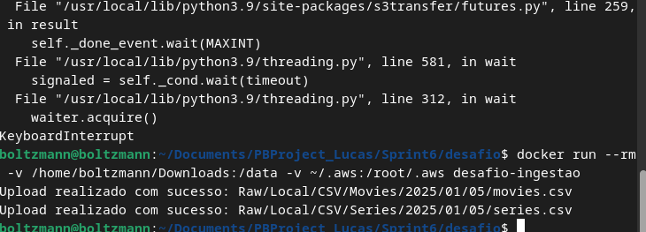

# Documentação do Desafio - Ingestão e Análise de Dados com S3 e Docker

## Introdução

Este desafio teve como objetivo explorar, processar e armazenar dados de séries e filmes. A atividade incluiu o uso de ferramentas como AWS S3 para armazenamento em nuvem e Docker para criar um ambiente replicável. Os dados fornecidos estavam em arquivos CSV contendo informações detalhadas sobre produções audiovisuais e seus artistas.

## Objetivo

O principal objetivo foi ingerir os dados para o Amazon S3 de maneira estruturada e preparar o ambiente para futuras análises que respondam a questões específicas.
Perguntas Propostas

Antes de iniciar a análise, defini algumas questões que os dados podem responder:

    1) Qual é a média das notas por gênero de séries e filmes ao longo dos anos?
    2) Existe uma correlação entre o número de votos e a nota média de uma produção?
    3) Quais são as profissões mais comuns entre os artistas com mais de 3 títulos conhecidos?
    4) Quais são os países predominantes entre os filmes e séries mais bem avaliados?

## Etapas do Desafio

1. Preparação do Ambiente

    Exploração inicial: Inspecionei os arquivos CSV fornecidos para compreender sua estrutura e identificar possíveis ajustes no carregamento.
    Configuração do bucket S3: Criei o bucket data-lake-desafio na AWS para armazenar os dados.
    Configuração de credenciais AWS: Atualizei o arquivo ~/.aws/credentials para permitir o acesso ao bucket.

2. Criação do Script de Ingestão

O script ingest_data.py foi desenvolvido para:

    -Validar a existência dos arquivos locais.
    -Definir a estrutura de pastas no bucket para armazenar os dados (ex.: Raw/Local/CSV).
    -Realizar o upload dos arquivos para o S3 utilizando a biblioteca boto3.

3. Criação e Teste da Imagem Docker

    Criei um Dockerfile com base em python:3.9-slim e instalei as dependências necessárias (boto3).
    Testei o script no container Docker para garantir que funcionava corretamente com os volumes mapeados.

4. Execução e Validação

    Mapeei os diretórios locais contendo os arquivos e as credenciais AWS no container.
    Realizei o upload bem-sucedido dos arquivos para o S3.

## Dificuldades Encontradas

    Erros no carregamento dos arquivos CSV:
        Os arquivos tinham um separador |, não padrão para pandas.read_csv.
        Alguns caracteres especiais exigiam a especificação da codificação UTF-8.

    Credenciais AWS:
        Inicialmente, o container Docker não conseguia acessar as credenciais AWS locais.
        Resolvi o problema ao mapear o diretório ~/.aws como volume no container.

    Interrupções no Docker:
        Durante a execução prolongada do script no Docker, enfrentei interrupções. A solução foi otimizar o script e validar os arquivos antes do upload.

## Evidencias

Aqui a evidencia que gerei no terminal utilizando o docker para que pudesse ser carregado no S3

Evidencia geradas no S3, mostrando que os arquivos foram carregados com sucesso usando o caminho relativo sugerido.

## Impressões Pessoais

Achei este desafio extremamente interessante, pois permitiu a prática de conceitos importantes como ingestão de dados em nuvem e uso de contêineres. A integração entre diferentes ferramentas (Python, Docker, AWS) demonstrou como essas tecnologias podem ser utilizadas juntas para resolver problemas reais.

Aprender a resolver problemas inesperados, como erros de credenciais e formatação de arquivos, foi enriquecedor e aumentou minha confiança no uso dessas ferramentas.

## Conclusão

Este desafio foi uma oportunidade de aplicar e expandir habilidades técnicas. Com os dados já carregados no S3, os próximos passos envolvem análise aprofundada e responder às perguntas definidas. 