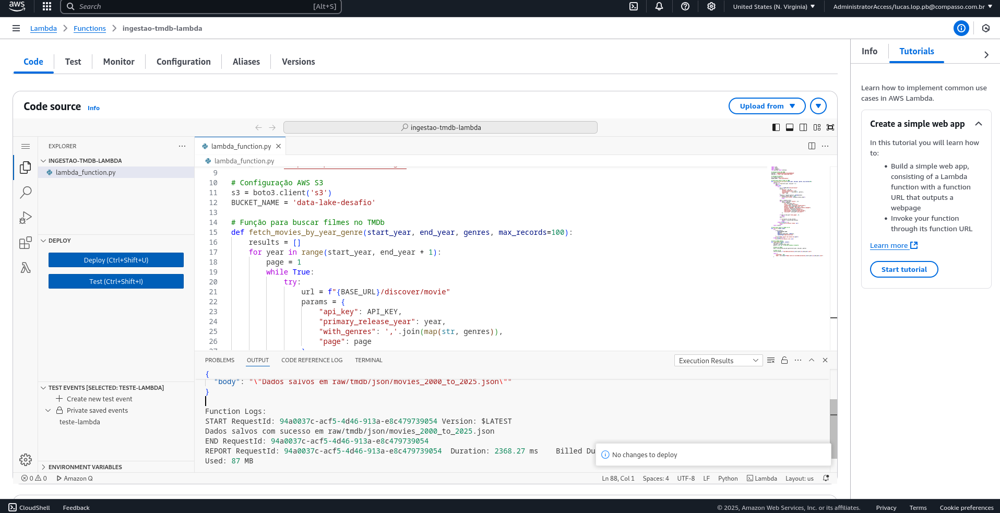
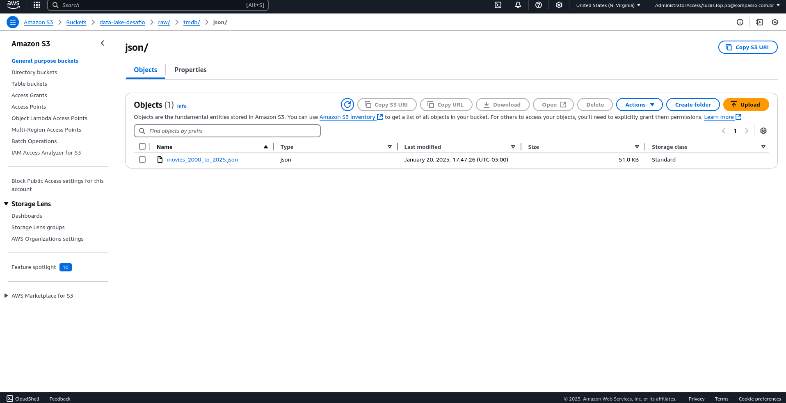

# **Desafio: Ingestão e Análise de Dados de Filmes e Séries**

## **Introdução**
Este desafio teve como objetivo criar um fluxo automatizado para a ingestão e armazenamento de dados de filmes e séries da API TMDB. A solução foi desenvolvida utilizando serviços AWS, incluindo Lambda, S3 e Athena, com a intenção de preparar os dados para análises futuras e visualizações em dashboards.

---

## **Objetivo**
Ingerir dados de filmes e séries dos gêneros **Comédia** e **Animação**, lançados de 2000 até o presente, e armazená-los no AWS S3 de forma estruturada. Posteriormente, os dados serão transformados e analisados para criar visualizações interativas que respondam às seguintes perguntas:

### **Perguntas para a Dashboard**
1. **Qual é a média das notas (vote_average) por ano e por gênero?**
2. **Quais são os filmes mais populares (popularidade) em Comédia e Animação?**
3. **Existe uma correlação entre o número de votos (vote_count) e a popularidade (popularity)?**
4. **Quais são os idiomas originais predominantes dos filmes de cada gênero?**
5. **Quais são os gêneros mais bem avaliados em média ao longo dos anos?**

---

## **Etapas do Desafio**

### **1. Configuração Inicial**
- Configurado o bucket **`data-lake-desafio`** no AWS S3 com as seguintes zonas:
  - **RAW Zone**: Para armazenar os dados brutos (JSON).
  - **Curated Zone**: Para armazenar os dados transformados e prontos para análise.

### **2. Desenvolvimento da Função Lambda**
- Criada uma função Lambda para buscar os dados da API TMDB e salvá-los no S3:
  - API utilizada: [TMDB API](https://www.themoviedb.org/documentation/api).
  - Bibliotecas usadas: `boto3`, `requests`, `json`.
  - A função foi automatizada para salvar os dados em `raw/tmdb/json/movies_2000_to_2025.json`.

### **3. Configuração de Layers na Lambda**
- Criada uma camada para incluir a biblioteca `requests`, necessária para consumir a API TMDB.

### **4. Execução e Validação**
- Testada a função Lambda com um evento de teste.
- Verificado que os dados foram salvos corretamente no S3 na zona RAW.

### **5. Planejamento do ETL**
- Planejado o processamento para:
  - Limpar e transformar os dados (remover inconsistências, formatar datas, etc.).
  - Salvar os dados transformados na zona Curated no formato **Parquet** ou **CSV**.

---

## **Detalhes Técnicos**

### **Estrutura do Arquivo JSON no S3**
Os dados salvos na zona RAW possuem a seguinte estrutura:

```json
{
  "id": 11688,
  "title": "The Emperor's New Groove",
  "release_date": "2000-12-15",
  "genres": [12, 16, 35],
  "original_language": "en",
  "overview": "When self-centered Emperor Kuzco is turned into a llama...",
  "popularity": 113.272,
  "vote_average": 7.6,
  "vote_count": 6777
}
```

---

## ** Evidencias**

Evidencia que rodou o codigo dentro do Lambda para enviar o arquivo ao S3


Evidencia do arquivo gerado dentro do S3



---


## **Conclusão**

Este desafio foi uma oportunidade para aplicar conceitos importantes de ingestão, transformação e análise de dados utilizando serviços AWS. A integração entre Lambda, S3 e Athena demonstrou como criar pipelines escaláveis para armazenamento e análise de dados.

Nos próximos passos, os dados transformados permitirão a criação de dashboards interativos que respondam às perguntas propostas.


