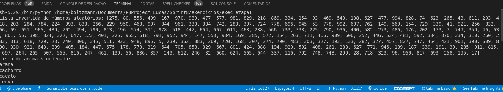
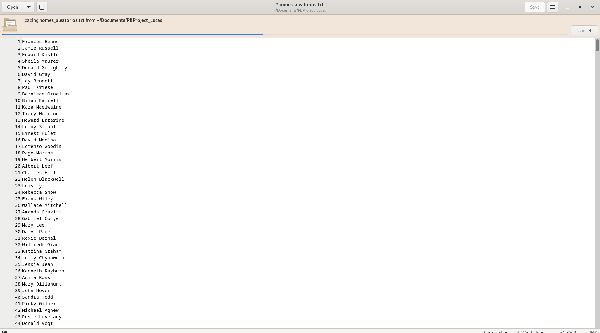
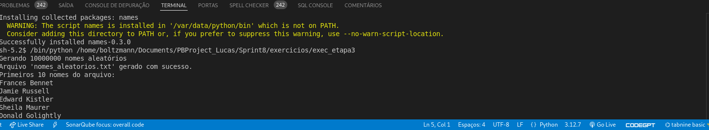
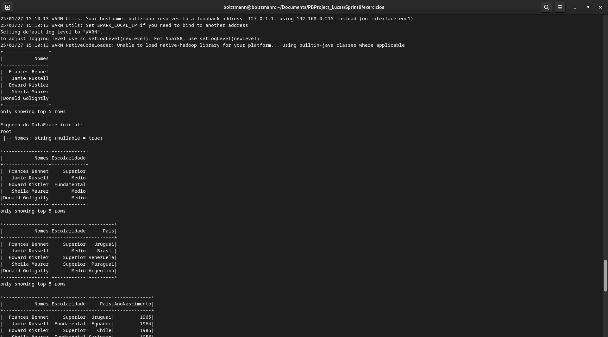
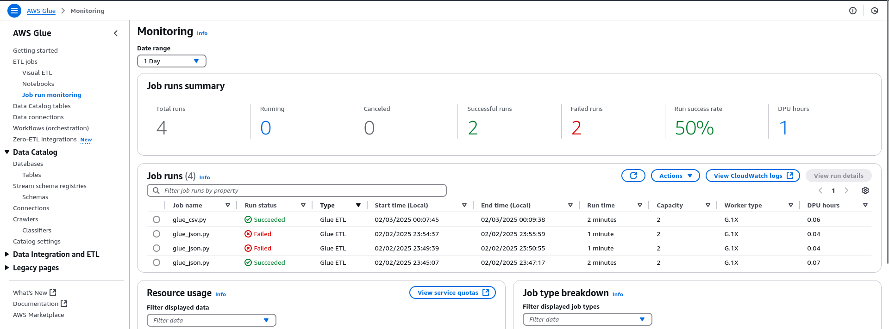

## **Sprint 8 - Ingestão e Processamento de Dados com Spark e AWS Glue**


### **Objetivos**

Nesta sprint, o objetivo principal foi aprofundar o conhecimento sobre ingestão e processamento de dados utilizando Apache Spark e AWS Glue. As atividades realizadas abrangeram desde a manipulação básica de dados com Python até o desenvolvimento de pipelines de processamento utilizando Spark SQL e AWS Glue para armazenar os dados de forma estruturada no AWS S3.

Abaixo temos o link para acessar as pastas da sprint:

[Link para as pastas da sprint](https://github.com/Boltzmann0/PBProject_Lucas/tree/main/Sprint8)

### Atividades Realizadas

A sprint foi dividida em três grandes blocos de atividades, sendo a ultima para o desafio:

1. Manipulação de Dados em Python
    🔹 Exercícios de manipulação e estruturação de dados utilizando listas e arquivos CSV.

2. Processamento de Dados com Spark
    🔹 Utilização do PySpark para transformar e enriquecer dados, aplicando consultas SQL e criando novas colunas derivadas.

3. Ingestão e Transformação de Dados com AWS Glue
    🔹 Pipeline completo de ingestão de arquivos CSV e JSON, transformação dos dados e armazenamento no AWS S3 para análise com AWS Athena.

### Manipulação de Dados em Python

Nesta etapa inicial, foram implementados dois exercícios de aquecimento (warm-up), com o objetivo de reforçar a manipulação de dados em listas e arquivos CSV.
Exercício 1 - Lista de Números Aleatórios

    Criamos uma lista contendo 250 números inteiros aleatórios.
    Aplicamos a função reverse() para inverter a ordem dos números.
    O resultado foi impresso na tela.

Trecho do código:
```
import random

numeros = [random.randint(1, 1000) for _ in range(250)]
numeros.reverse()

print(numeros)
```
Exercício 2 - Lista de Animais e Salvamento em CSV

    Criamos uma lista contendo 20 nomes de animais.
    Ordenamos os elementos em ordem crescente.
    Armazenamos os dados em um arquivo CSV, com um nome por linha.

Trecho do código:
```
animais = ["Cachorro", "Gato", "Elefante", "Leão", "Tigre", "Zebra", "Girafa", "Cavalo", "Urso", "Panda",
           "Macaco", "Lobo", "Raposa", "Coelho", "Cobra", "Papagaio", "Golfinho", "Águia", "Jacaré", "Tatu"]

animais.sort()

with open("animais.csv", "w") as file:
    for animal in animais:
        file.write(f"{animal}\n")
```

### Processamento de Dados com Spark

Nesta etapa, utilizamos PySpark para manipular e enriquecer os dados de um arquivo de nomes aleatórios, aplicando transformações, filtros e consultas SQL.

Etapas Realizadas

-Leitura do arquivo CSV com Spark.
-Adição das colunas Escolaridade, País e Ano de Nascimento com valores aleatórios.
-Filtragem de registros com Spark DataFrame API e Spark SQL.
-Contagem e agrupamento de dados por geração e país.

Trecho do código:
```
df_nomes = spark.read.csv("nomes_aleatorios.txt", header=False, inferSchema=True)
df_nomes = df_nomes.withColumnRenamed("_c0", "Nomes")

df_nomes.createOrReplaceTempView("pessoas")
millennials_count = spark.sql("SELECT COUNT(*) FROM pessoas WHERE AnoNascimento BETWEEN 1980 AND 1994")
millennials_count.show()
```
Consulta SQL para agrupar os dados por geração:
```
SELECT Pais, 
    CASE 
        WHEN AnoNascimento BETWEEN 1944 AND 1964 THEN 'Baby Boomers'
        WHEN AnoNascimento BETWEEN 1965 AND 1979 THEN 'Geração X'
        WHEN AnoNascimento BETWEEN 1980 AND 1994 THEN 'Millennials'
        WHEN AnoNascimento BETWEEN 1995 AND 2015 THEN 'Geração Z'
        ELSE 'Outros'
    END AS Geracao,
    COUNT(*) AS Quantidade
FROM pessoas
GROUP BY Pais, Geracao
ORDER BY Pais, Geracao, Quantidade;
```

Desafio - Ingestão e Processamento de Dados com AWS Glue

Nesta etapa, os dados foram ingeridos e processados utilizando AWS Glue, convertendo arquivos CSV e JSON para Parquet e organizando-os na Trusted Zone.

Estrutura dos Arquivos no AWS S3
```
Dados CSV - Filmes e Séries
s3://data-lake-desafio/Raw/Local/CSV/Movies/
s3://data-lake-desafio/Raw/Local/CSV/Series/
```
Dados JSON - API TMDB
```
s3://data-lake-desafio/Raw/TMDB/JSON/{ano}/{mes}/{dia}/

```
3.1 Processamento de Arquivos CSV no AWS Glue

Os arquivos CSV foram processados no AWS Glue, sem particionamento, e armazenados na Trusted Zone:
```
s3://data-lake-desafio/Trusted/Local/Parquet/Movies/
s3://data-lake-desafio/Trusted/Local/Parquet/Series/
```

Trecho do código no AWS Glue para processamento de CSV:
```
movies_df.write.mode("overwrite").parquet("s3://data-lake-desafio/Trusted/Local/Parquet/Movies/")
series_df.write.mode("overwrite").parquet("s3://data-lake-desafio/Trusted/Local/Parquet/Series/")
```
3.2 Processamento de Arquivos JSON no AWS Glue

Os arquivos JSON foram convertidos para Parquet e particionados por ano, mês e dia para otimizar as consultas.
```
s3://data-lake-desafio/Trusted/TMDB/Parquet/{ano}/{mes}/{dia}/
```
Trecho do código no AWS Glue para JSON:
```
df = spark.read.option("multiline", "true").json("s3://data-lake-desafio/Raw/TMDB/JSON/*/*/*/")

df = df.withColumn("release_date", F.to_date("release_date", "yyyy-MM-dd"))
df = df.withColumn("ano", F.year("release_date"))
df = df.withColumn("mes", F.month("release_date"))
df = df.withColumn("dia", F.dayofmonth("release_date"))

df.write.mode("overwrite").partitionBy("ano", "mes", "dia").parquet("s3://data-lake-desafio/Trusted/TMDB/Parquet/")
```
Consultas e Análises no AWS Athena

Após a ingestão e processamento dos dados, utilizamos AWS Athena para realizar consultas SQL e explorar insights.

Exemplo de consulta SQL - Média de Notas por Gênero e Ano
```
SELECT ano, genero, AVG(vote_average) AS media_nota
FROM "data_lake_trusted"
GROUP BY ano, genero
ORDER BY ano DESC;
```
Exemplo de consulta SQL - Filmes Mais Populares
```
SELECT title, popularity
FROM "data_lake_trusted"
ORDER BY popularity DESC
LIMIT 10;
```

### Evidencias

Evidencias feitas nessa sprint com os exercicios e tambem do desafio:













### Certificados

Nessa sprint nao teve cursos da AWS para a geracao de certificados.

### Conclusão da Sprint

Esta sprint proporcionou um aprendizado prático e estruturado sobre ingestão, processamento e análise de dados na AWS. As etapas envolvidas incluíram desde a manipulação básica em Python até a construção de pipelines avançados no AWS Glue.