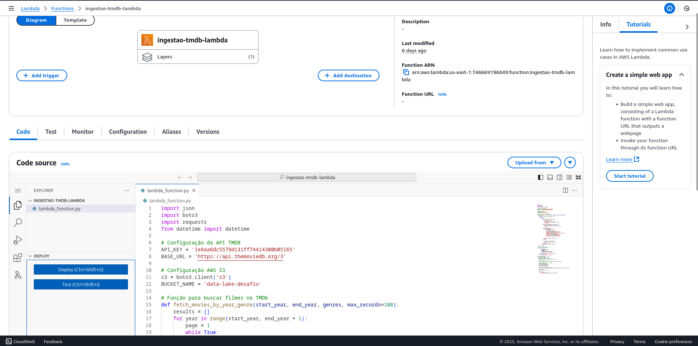
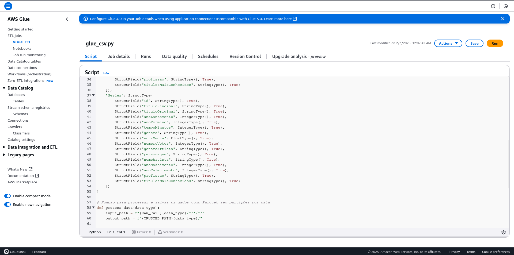
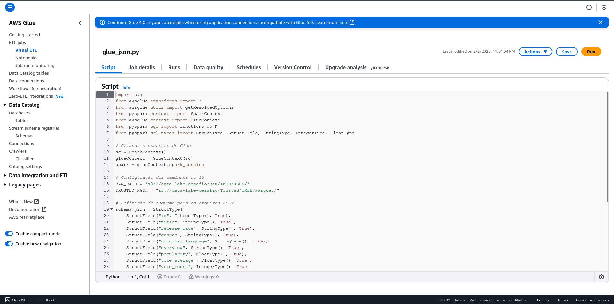
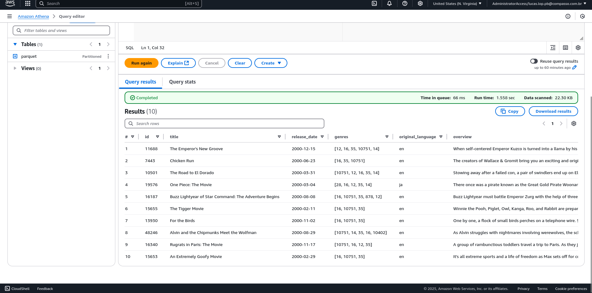

## **Desafio - Ingestão e Processamento de Dados com AWS Glue**

### **1. Introdução**

Este desafio teve como objetivo explorar, processar e armazenar dados de séries e filmes utilizando serviços da AWS. Foram utilizadas ferramentas como AWS S3 para armazenamento, AWS Glue para processamento de dados e AWS Lambda para ingestão automatizada.

O fluxo de dados envolveu a coleta de informações da API TMDB e de arquivos CSV contendo dados sobre séries e filmes. Após a ingestão, os dados foram transformados e armazenados na camada Trusted do Data Lake para futuras análises no AWS Athena.

### **2. Objetivo**

O principal objetivo foi realizar a ingestão de dados provenientes de diferentes fontes (arquivos CSV e API TMDB) e estruturá-los na Trusted Zone do Data Lake. Após a ingestão, os dados foram transformados utilizando Apache Spark no AWS Glue e armazenados em formato Parquet, possibilitando consultas otimizadas via AWS Athena.

### **3. Motivadores do Uso de Cada Tecnologia**

Amazon S3 - Utilizado para armazenamento dos dados brutos (Raw Zone) e processados (Trusted Zone).

AWS Lambda -Responsável por capturar os dados da API TMDB e enviá-los para a Raw Zone do S3.

AWS Glue - Utilizado para transformar os dados das camadas Raw para Trusted.Integra-se facilmente com o AWS Athena, permitindo consultas otimizadas. Trabalha com Apache Spark, permitindo processamento distribuído.

AWS Athena - Permite consultar os dados estruturados via SQL sem necessidade de provisionar um banco de dados.


### **4. Perguntas que Serão Respondidas na Análise Final**

Qual é a média das notas (vote_average) por ano e por gênero?

Quais são os filmes mais populares nos gêneros Comédia e Animação?

Existe uma correlação entre o número de votos (vote_count) e a popularidade (popularity)?

Quais são os idiomas predominantes nos filmes de cada gênero?

Quais são os gêneros mais bem avaliados em média ao longo dos anos?


### **5. Etapas do Desafio**

Os dados foram armazenados na camada Raw no AWS S3, sendo estruturados em:

Arquivos CSV armazenados na pasta:
```
s3://data-lake-desafio/Raw/Local/CSV/Movies/
s3://data-lake-desafio/Raw/Local/CSV/Series/
```
Arquivos JSON da API TMDB armazenados em:
```
s3://data-lake-desafio/Raw/TMDB/JSON/{ano}/{mes}/{dia}/
```

5.1 Upload de Arquivos CSV para o S3

Os arquivos CSV contendo informações sobre filmes e séries foram carregados para o S3 utilizando Boto3. O processo incluiu:

    Verificação da existência dos arquivos antes do envio.
    Organização em diretórios estruturados dentro do bucket.
    Automação do upload para evitar falhas manuais.

Exemplo do trecho de código para upload de arquivos CSV ao S3:
```
s3_key = f"Raw/Local/CSV/Movies/movies.csv"
s3_client.upload_file("caminho_local/movies.csv", BUCKET_NAME, s3_key)
```
Esse trecho de código garante que os arquivos sejam armazenados corretamente dentro da estrutura Raw/Local/CSV.


5.2 Ingestão de Dados da API TMDB

Para coletar informações sobre filmes de comédia e animação, foi utilizada a API TMDB. Os dados foram armazenados no S3 em formato JSON.

A função AWS Lambda foi responsável por:

1. Fazer chamadas à API TMDB para recuperar dados de filmes.
2. Estruturar e transformar os dados para armazenamento.
3. Enviar os arquivos JSON para o S3, mantendo a organização.

Trecho da função Lambda que salva os dados no S3:
```
save_to_s3(data, f"Raw/TMDB/JSON/{datetime.now().strftime('%Y/%m/%d')}/movies.json")
```
Esse trecho garante que os arquivos sejam armazenados dinamicamente na estrutura Raw/TMDB/JSON por ano/mês/dia.

**Processamento dos Dados no AWS Glue**

Após a ingestão, os dados foram transformados utilizando AWS Glue e armazenados na camada Trusted.

***Processamento de CSV no AWS Glue***

Os arquivos CSV foram processados e armazenados na Trusted Zone, sem particionamento por data, garantindo a integridade e estruturação dos dados.

Estrutura final no S3:
```
s3://data-lake-desafio/Trusted/Local/Parquet/Movies/
s3://data-lake-desafio/Trusted/Local/Parquet/Series/
```

Trecho do código para salvar os dados como Parquet na Trusted Zone:
```
movies_df.write.mode("overwrite").parquet("s3://data-lake-desafio/Trusted/Local/Parquet/Movies/")
```
Os dados são convertidos para Parquet e organizados corretamente na camada Trusted.


***Processamento de JSON no AWS Glue***

Os arquivos JSON da API TMDB foram transformados para Parquet e armazenados na Trusted Zone, particionados por ano, mês e dia.

Estrutura final no S3:
```
s3://data-lake-desafio/Trusted/TMDB/Parquet/{ano}/{mes}/{dia}/
```

Durante esse processo, foi necessário converter a data de lançamento do filme (release_date) para extrair ano, mês e dia, facilitando a análise futura no Athena.

Trecho do código que adiciona as colunas de partição ao dataset:
```
df = df.withColumn("release_date", F.to_date("release_date", "yyyy-MM-dd"))
df = df.withColumn("ano", F.year("release_date"))
df = df.withColumn("mes", F.month("release_date"))
df = df.withColumn("dia", F.dayofmonth("release_date"))
```

Essa transformação permite que os dados sejam organizados e consultados de maneira eficiente.

### **6. Evidências**

1. Execução do Lambda para Captura da API TMDB



2. Execução do AWS Glue para Processamento dos CSVs




3. Execução do AWS Glue para Processamento dos JSONs




4. Consulta no Athena



### **7. Conclusão**

Este desafio proporcionou experiência prática em integração de dados na AWS, manipulação de arquivos CSV e JSON, uso do AWS Glue para ETL e armazenamento de dados estruturados para análise no Athena. 