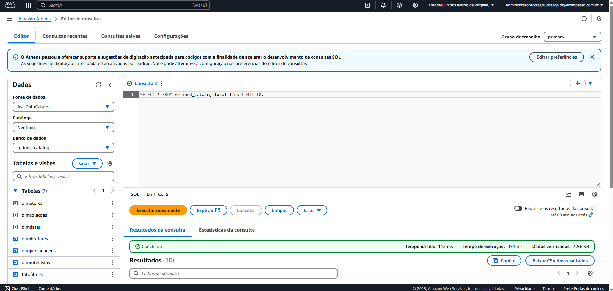
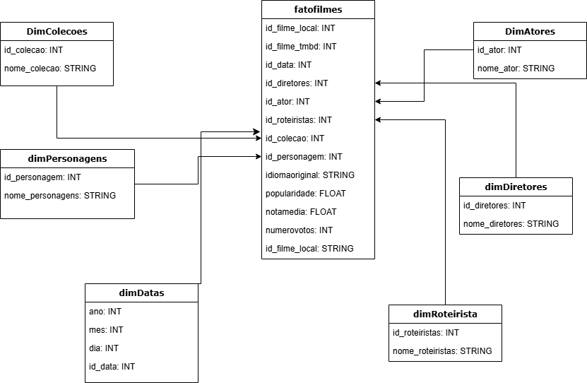

## Desafio - Criação da Camada Refined no Data Lake

### Introdução

Este desafio teve como objetivo a criação da camada Refined dentro do Data Lake, consolidando e estruturando os dados da camada Trusted. Durante essa etapa, enfrentamos desafios relacionados à modelagem dos dados, ajuste de schemas e união de múltiplas fontes.

### Objetivo

O objetivo foi modelar e criar a camada Refined no AWS Glue, utilizando Spark para processar os dados da camada Trusted, armazenando-os em formato Parquet e disponibilizando tabelas organizadas para análise posterior no QuickSight e Athena.

### Etapas do Desafio

#### 1. Carregamento dos Dados

Os dados utilizados neste desafio vieram de duas fontes principais:

Dados do TMDB armazenados na Trusted Zone no caminho:
```
s3://data-lake-desafio/Trusted/TMDB/Parquet/
```
Dados Locais (CSV de filmes e séries) armazenados na Trusted Zone no caminho:
```
s3://data-lake-desafio/Trusted/Local/Parquet/Movies/
s3://data-lake-desafio/Trusted/Local/Parquet/Series/
```
Trecho de código utilizado para carregar os dados no AWS Glue:
```
import sys
from pyspark.context import SparkContext
from awsglue.context import GlueContext
from pyspark.sql import functions as F

sc = SparkContext()
glueContext = GlueContext(sc)
spark = glueContext.spark_session

# Caminhos da Trusted Zone
TRUSTED_TMDB_PATH = "s3://data-lake-desafio/Trusted/TMDB/Parquet/"
TRUSTED_LOCAL_PATH = "s3://data-lake-desafio/Trusted/Local/Parquet/"

# Carregar dados
print("Carregando dados...")
df_tmdb = spark.read.parquet(f"{TRUSTED_TMDB_PATH}*/*/*/")
df_local_movies = spark.read.option("header", "true").option("delimiter", "|").csv(f"{TRUSTED_LOCAL_PATH}Movies/")
df_local_series = spark.read.option("header", "true").option("delimiter", "|").csv(f"{TRUSTED_LOCAL_PATH}Series/")
```
#### 2. Problemas Enfrentados e Correções

Erro de Separador no CSV

O arquivo CSV estava utilizando pipe (|) como delimitador, o que causava problemas ao carregar os dados corretamente. A solução foi adicionar a opção option("delimiter", "|") ao ler o CSV:
```
df_local_movies = spark.read.option("header", "true").option("delimiter", "|").csv(f"{TRUSTED_LOCAL_PATH}Movies/")
df_local_series = spark.read.option("header", "true").option("delimiter", "|").csv(f"{TRUSTED_LOCAL_PATH}Series/")
```
Inconsistência de IDs entre TMDB e CSVs Locais

O id do TMDB e dos arquivos CSV não seguiam o mesmo padrão. Para resolver isso, criamos um id único para cada filme ao consolidar os dados:
```	
df_filmes = df_filmes.withColumn("id_filme", F.monotonically_increasing_id())
```
#### 3. Criação da Camada Refined

Com os dados corrigidos, foi necessário estruturar as tabelas na Refined Zone no seguinte caminho:
```
s3://data-lake-desafio/Refined/
```
3.1 Tabelas Criadas

Tabela FatoFilmes

Armazena informações sobre os filmes e séries, como gênero, nota média e número de votos.
```
fato_filmes = df_filmes.select(
    "id_filme",
    "tituloPrincipal",
    "dataLancamento",
    "notaMedia",
    "numeroVotos",
    "popularidade",
    "idiomaOriginal"
)
```

Tabela DimAtores

Contém os atores associados aos filmes e séries.
```
dim_atores = df_filmes.selectExpr("id_filme", "nomeArtista as nome").distinct()
dim_atores = dim_atores.withColumn("id_ator", F.monotonically_increasing_id())
dim_atores.write.mode("overwrite").parquet(f"{REFINED_PATH}DimAtores/")
```
Tabela DimPersonagens
```
dim_personagens = df_filmes.selectExpr("id_filme", "personagem").distinct()
dim_personagens = dim_personagens.withColumn("id_personagem", F.monotonically_increasing_id())
dim_personagens.write.mode("overwrite").parquet(f"{REFINED_PATH}DimPersonagens/")
```
Tabela DimDiretores
```
dim_diretores = df_filmes.selectExpr("id_filme", "profissao", "nomeArtista") \
                         .filter(F.col("profissao") == "Director").distinct()
dim_diretores = dim_diretores.withColumn("id_diretor", F.monotonically_increasing_id())
dim_diretores.write.mode("overwrite").parquet(f"{REFINED_PATH}DimDiretores/")
```	
Tabela DimRoteiristas
```	
dim_roteiristas = df_filmes.selectExpr("id_filme", "profissao", "nomeArtista") \
                           .filter(F.col("profissao") == "Writer").distinct()
dim_roteiristas = dim_roteiristas.withColumn("id_roteirista", F.monotonically_increasing_id())
dim_roteiristas.write.mode("overwrite").parquet(f"{REFINED_PATH}DimRoteiristas/")
```
#### 4. Resultados e Próximos Passos

#### Evidências

Após o processamento, os dados ficaram disponíveis na Refined Zone organizados em tabelas estruturadas, permitindo a análise no AWS Athena e QuickSight.



A modelagem realizada para o desafio



#### Erros Enfrentados e Soluções

Problema: Coluna nomeArtista não encontrada em alguns datasets.

Solução: Garantir que todas as colunas existam antes de realizar unionByName().

Problema: Algumas tabelas ficaram vazias após o processamento.

Solução: Testar as consultas SQL no Athena para verificar se os filtros estavam corretos.

#### Próximos Passos

Criar consultas SQL no Athena para validar a integridade dos dados.

Construir dashboards no QuickSight para análise exploratória.

### Conclusão

Esse desafio proporcionou uma experiência prática na modelagem de um Data Lake estruturado, aprimorando a manipulação de dados no AWS Glue, integração de múltiplas fontes e armazenamento otimizado no formato Parquet para análise eficiente.